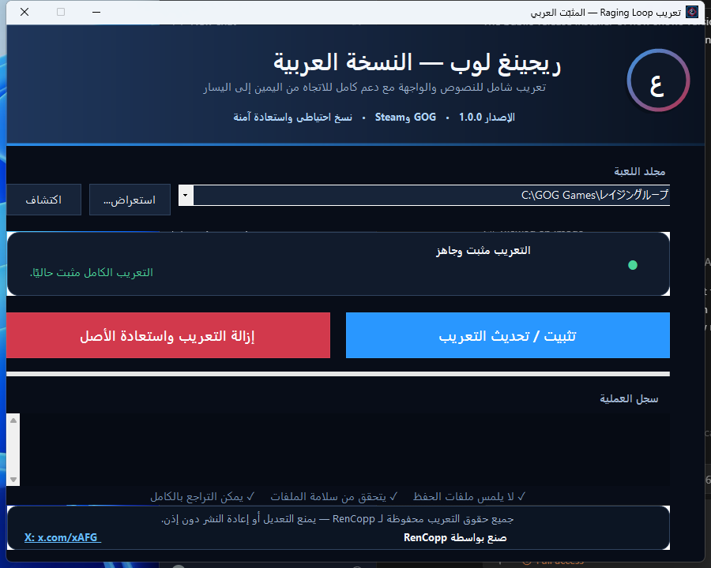

# التعريب العربي الكامل للعبة Raging Loop

تعريب عربي غير رسمي وكامل للعبة **Raging Loop** على Windows، من إعداد **RenCopp**.

> حالة النشر: الإصدار 1.0.0 متاح الآن للتنزيل من صفحة **Releases**.

[حساب RenCopp على X](https://x.com/xAFG_)



## المزايا

- تعريب القصة كاملة: 39,746 مقطعًا حواريًا.
- تعريب جميع الخيارات وعددها 280 خيارًا.
- تعريب القوائم، مخطط السيناريو، القصص الإضافية، مفاتيح الكشف والاعتمادات.
- تعريب صور الأيام والتواريخ وإزالة المربعات العشوائية.
- خط **Noto Sans Arabic** مضمّن وواضح.
- ظهور النص العربي من اليمين إلى اليسار.
- الإبقاء على أسماء المصطلحات اليابانية المهمة بصيغة عربية عندما يشرحها سياق القصة.
- دعم نسختي **GOG** و**Steam**.
- إنشاء نسخة احتياطية تلقائية والتحقق من سلامة كل ملف باستخدام SHA-256.
- إزالة آمنة للتعريب واستعادة الملفات الأصلية من داخل المثبّت نفسه.

## متطلبات التشغيل

- Windows 10 أو Windows 11 بنواة 64 بت.
- نسخة أصلية مثبتة من Raging Loop على GOG أو Steam.
- إغلاق اللعبة قبل التثبيت أو الإزالة.

## طريقة التثبيت

1. نزّل الملف `RagingLoopAR.exe` من صفحة **Releases**.
2. أغلق اللعبة إن كانت تعمل.
3. شغّل المثبّت. لا يحتاج إلى تثبيت برامج إضافية.
4. سيحاول زر **اكتشاف** العثور على مجلد اللعبة تلقائيًا. إذا لم يجده، اضغط **استعراض** واختر المجلد الذي يحتوي على `ragingloop.exe`.
5. اضغط **تثبيت / تحديث التعريب** وانتظر ظهور رسالة نجاح العملية.
6. شغّل اللعبة، اختر **العربية**، ثم اضغط **ابدأ**.

## طريقة التحديث

شغّل أحدث إصدار من `RagingLoopAR.exe`، اختر مجلد اللعبة نفسه، ثم اضغط **تثبيت / تحديث التعريب**. يحتفظ المثبّت بالنسخة الأصلية التي أنشأها أول مرة.

## طريقة إزالة التعريب

1. أغلق اللعبة.
2. شغّل `RagingLoopAR.exe`.
3. اختر مجلد اللعبة.
4. اضغط **إزالة التعريب واستعادة الأصل**.

لا يلمس المثبّت ملفات الحفظ عند التثبيت أو الإزالة.

## التحقق من سلامة التحميل

بصمة SHA-256 للإصدار 1.0.0:

```text
71AB85965CC7B861DB3A18B4329EBC6C1031BF949443843EE7B2CDE310C631EA  RagingLoopAR.exe
```

يمكن التحقق منها في PowerShell:

```powershell
Get-FileHash .\RagingLoopAR.exe -Algorithm SHA256
```

## حل المشكلات

- **لم يُعثر على اللعبة:** اختر يدويًا المجلد الذي يحتوي على `ragingloop.exe`.
- **اللعبة مفتوحة:** أغلق اللعبة ثم أعد المحاولة.
- **إصدار الملفات غير مدعوم:** استخدم خيار التحقق/الإصلاح في GOG Galaxy أو Steam، ثم أعد التثبيت.
- **إزالة التعريب:** يجب استعمال المثبّت نفسه حتى يعيد النسخة الاحتياطية بأمان.

## الحقوق والتنبيه

حقوق نصوص التعريب وبرنامج المثبّت محفوظة لـ **RenCopp**. يمنع تعديل التعريب أو إعادة رفعه أو إعادة نشره دون إذن كتابي مسبق.

Raging Loop وجميع أصول اللعبة وعلاماتها مملوكة لأصحابها. هذا مشروع تعريب غير رسمي، ولا يتضمن أي تنازل عن حقوق أصحاب اللعبة، ويتطلب امتلاك نسخة أصلية منها.
